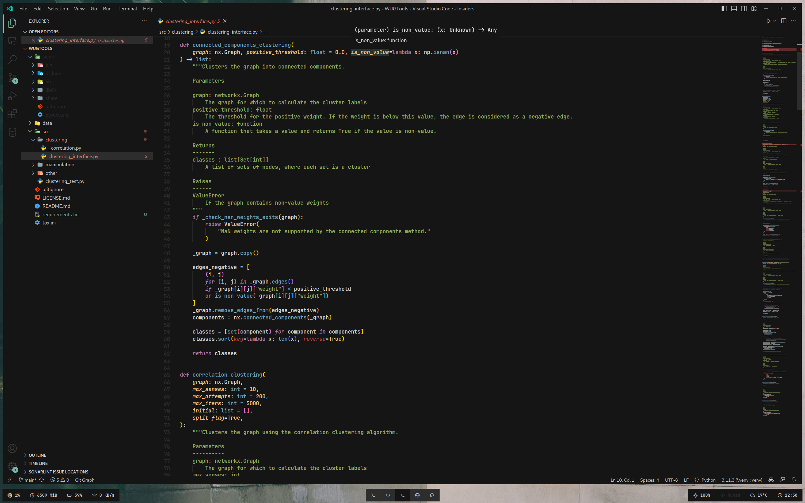

# Base16 Classic Dark

This is my personal take on the `Base16 Classic Dark` theme for Visual Studio Code. It is based on a `Base16 Classic Dark` color scheme I used for a long time for my terminal and neovim, but I never found a good theme for VS Code. So I decided to create, or rather port, one myself.

## License

This project is licensed under the MIT License - see the [LICENSE.md](LICENSE.md) file for details. Note that this only extends to my code and other modules, fonts, etc. are licensed under their respective licenses and do not fall under this license. If you find any license violations, please contact me immediately, as this is not intended.